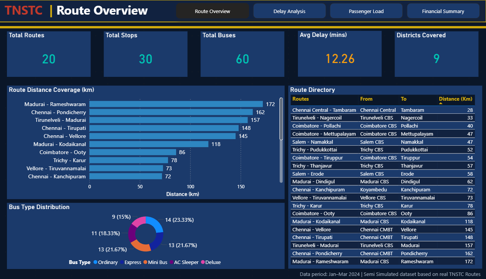
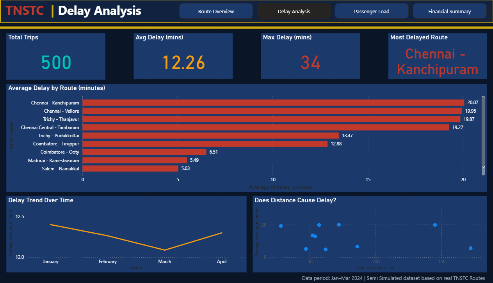
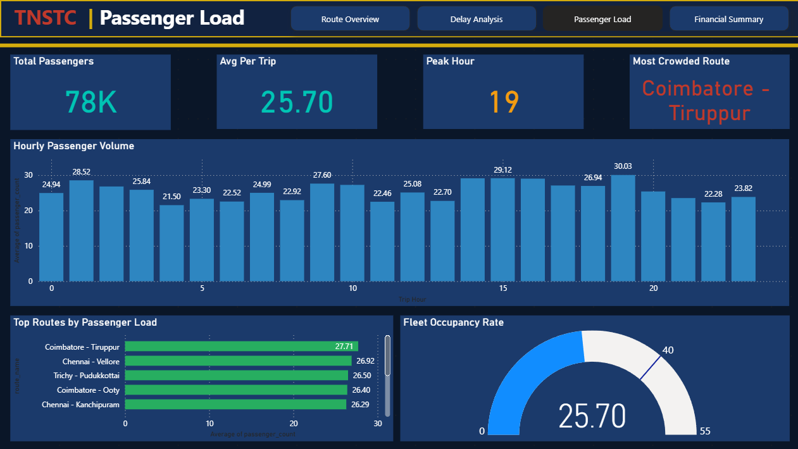
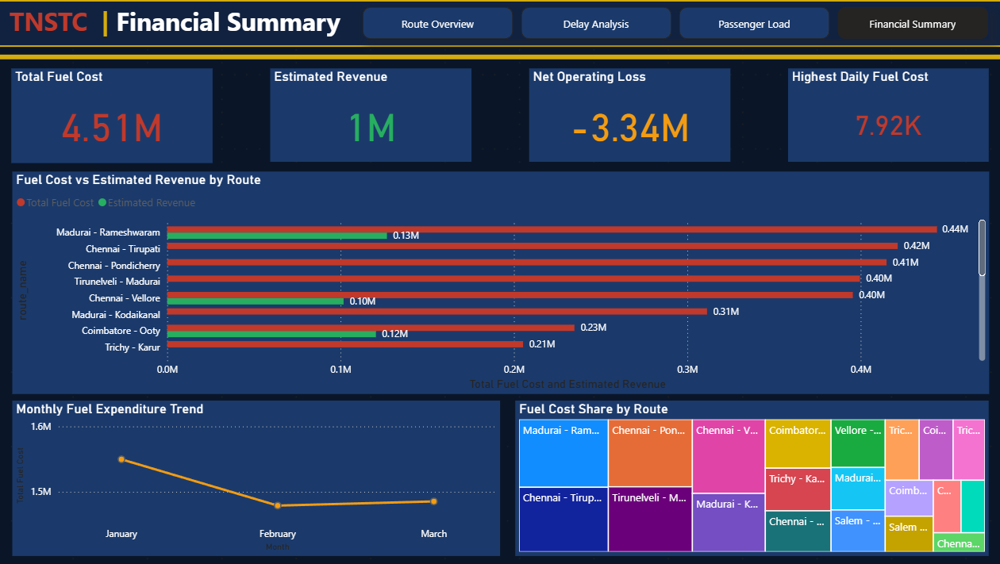

# 🚌 TNSTC Bus Route Optimization & Efficiency Analytics

A full end-to-end data analytics project built on Tamil Nadu State Transport Corporation (TNSTC) bus operations data — covering data simulation, cleaning, MySQL database design, SQL analysis, Python EDA, and a 4-page Power BI dashboard.

---

## 📊 Dashboard Preview

| Route Overview | Delay Analysis |
|---|---|
|  |  |

| Passenger Load | Financial Summary |
|---|---|
|  |  |

---

## 🎯 Problem Statement

TNSTC operates thousands of bus routes daily but has no unified analytics system to track:
- Route efficiency and delay patterns
- Passenger load and peak hour demand
- Fuel cost vs revenue per route
- Underperforming routes wasting resources

This project builds a complete analytics pipeline to surface those insights.

---

## 🗂️ Project Structure

```
TNSTC_PROJECT/
│
├── simulate_data.py          # Generates 7 realistic CSV datasets
├── clean_data.py             # Validates and cleans all CSVs
├── load_to_mysql.py          # Loads clean data into MySQL
├── eda_charts.py             # Generates 5 EDA charts as PNG
├── analysis_queries.sql      # 6 SQL analysis queries
├── mysql_setup.sql           # MySQL schema creation script
│
├── tnstc_data_clean/         # Cleaned CSV files (7 tables)
├── charts/                   # EDA chart PNG outputs
│
├── dashboard_page1_route_overview.png.png
├── dashboard_page2_delay_analysis.png.png
├── dashboard_page3_passenger_load.png
├── dashboard_page4_financial_summary.png
│
├── TNSTC_Project_Documentation.docx
├── requirements.txt
└── README.md
```

---

## 🛠️ Tech Stack

| Tool | Purpose |
|---|---|
| Python 3.13 | Data simulation, cleaning, EDA |
| MySQL 9.x | Relational database |
| Power BI Desktop | Interactive dashboard |
| pandas | Data manipulation |
| matplotlib / seaborn | Chart generation |
| mysql-connector-python | Python to MySQL connection |

---

## 🗄️ Database Schema

Database: `tnstc_analytics`

| Table | Rows | Description |
|---|---|---|
| `routes` | 20 | Route names, start/end stops, distance |
| `stops` | 30 | Stop names with GPS coordinates |
| `route_stops` | 120 | Junction table — which stops on which route |
| `buses` | 60 | Bus type and capacity per route |
| `trips` | 500 | Scheduled vs actual departure times |
| `passenger_load` | 3,041 | Passenger count per trip per stop |
| `fuel_expenses` | 1,800 | Daily fuel cost per route |
| **Total** | **5,571** | |

### Relationships

```
routes ──< trips
routes ──< buses
routes ──< route_stops
routes ──< fuel_expenses
stops  ──< route_stops
stops  ──< passenger_load
trips  ──< passenger_load
```
All relationships are One-to-Many (1:*).

---

## ⚙️ How to Run

### 1. Clone the repo
```bash
git clone https://github.com/YOUR_USERNAME/tnstc-analytics.git
cd tnstc-analytics
```

### 2. Install dependencies
```bash
pip install -r requirements.txt
```

### 3. Generate the data
```bash
python simulate_data.py
```

### 4. Clean the data
```bash
python clean_data.py
```

### 5. Load into MySQL
Open `load_to_mysql.py` and update your MySQL password on line 13:
```python
MYSQL_PASSWORD = "your_password_here"
```
Then run:
```bash
python load_to_mysql.py
```

### 6. Run SQL analysis
Open `analysis_queries.sql` in MySQL Workbench and execute each query against the `tnstc_analytics` database.

### 7. Generate EDA charts
```bash
python eda_charts.py
```
Charts are saved to the `charts/` folder.

### 8. Open Power BI Dashboard
Open Power BI Desktop → Get Data → Text/CSV → load all 7 files from `tnstc_data_clean/`

---

## 🔍 Key Findings

| Analysis | Finding |
|---|---|
| Most delayed route | Madurai – Rameshwaram (22.37 min avg delay) |
| Least delayed route | Tirunelveli – Nagercoil (2.6 min avg delay) |
| Most underutilized | Trichy – Thanjavur (23.8% occupancy) |
| Peak travel hour | 7 PM — 43.4 avg passengers |
| Best performing route | Coimbatore – Pollachi |
| Worst performing route | Madurai – Rameshwaram |
| Biggest hub | Coimbatore CBS (4 routes, 227 km) |
| Financial insight | All routes operate at a net loss — government subsidized |

---

## 📈 SQL Queries

Six analysis queries are in `analysis_queries.sql`:

1. Top 10 most delayed routes
2. Underutilized routes by occupancy %
3. Peak hour passenger volume
4. Fuel cost vs estimated revenue per route
5. Route performance classification (Good / Average / Poor)
6. District-wise route coverage

---

## 📉 EDA Charts

| Chart | Insight |
|---|---|
| `delayed_routes.png` | Top 10 routes by average delay |
| `peak_hours.png` | Passenger load across all hours |
| `performance_distribution.png` | % of Good / Average / Poor routes |
| `underutilized_routes.png` | Routes with lowest occupancy |
| `district_coverage.png` | Hub-wise route and distance comparison |

---

## 📋 Data Note

This project uses a **simulated dataset** generated to reflect realistic TNSTC operations:
- Route names and terminal names are real TNSTC routes
- GPS coordinates are real Tamil Nadu locations
- Passenger counts, delays, and fuel costs are statistically simulated
- TNSTC does not publish live operational data publicly

---

## 📁 Documentation

Full project documentation including schema, SQL queries, findings, and Power BI theme details is in:
`TNSTC_Project_Documentation.docx`

---

## 👤 Author

Built as a portfolio data analytics project demonstrating:
- End-to-end data pipeline design
- Relational database modeling
- SQL analytical queries
- Python EDA and visualization
- Power BI dashboard development
